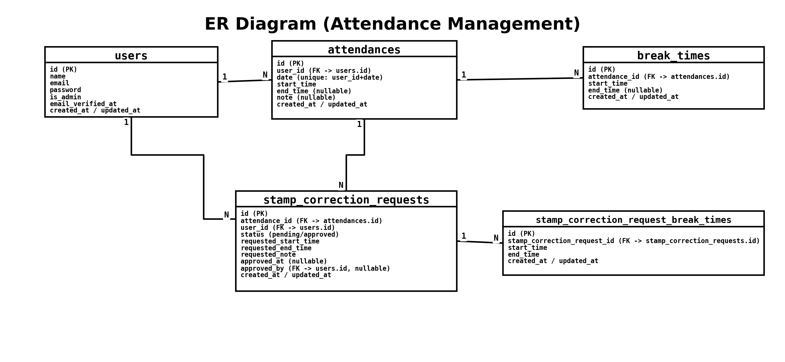

# Attendance_Management（勤怠管理アプリ）

Laravel + Laravel Sail（Docker）で動作する勤怠管理アプリです。  
ローカル環境では MySQL / Redis / Mailpit を起動し、認証は Laravel Fortify（メール認証あり）を使用します。

- Repository: `https://github.com/takuya0521/Attendance_Management`

---

## 機能一覧（設計書より）

### 一般ユーザー

- 会員登録（メール認証あり）: 登録 → 認証メール送信 → 認証完了後に各機能へアクセス（US001）
- ログイン / ログアウト（US002 / US003）
- 勤怠打刻（US006）
    - 現在日時の取得（日時表示）
    - 出勤 / 休憩開始 / 休憩終了 / 退勤
- 勤怠一覧の確認（US007）
    - 当日の勤怠表示
    - 月次一覧（前月 / 翌月への移動）
- 勤怠詳細の確認・修正申請（US008）
- 自分の修正申請一覧の確認（承認待ち / 承認済み）（US009）

### 管理者

- 管理者ログイン / ログアウト（US004 / US005）
- 日次勤怠一覧の確認（US010）
- 勤怠詳細の確認・修正（US011）
- スタッフ（ユーザー）一覧の確認（US012）
- 修正申請の一覧確認・承認（※アプリ実装に含む）

---

## 画面一覧（設計書より）

| 画面ID | 画面名                 | パス（設計書）                                                 | 留意点 |
| ------ | ---------------------- | -------------------------------------------------------------- | ------ |
| PG01   | 会員登録画面           | `/register`                                                    |        |
| PG02   | ユーザーログイン画面   | `/login`                                                       |        |
| PG03   | メール認証画面         | `/email/verify`                                                |        |
| PG04   | 勤怠画面               | `/attendance`                                                  |        |
| PG05   | 勤怠一覧画面           | `/attendance/list`                                             |        |
| PG06   | 修正申請一覧画面       | `/stamp_correction_request/list`                               |        |
| PG07   | 勤怠詳細画面           | `/attendance/{attendance}`                                     |        |
| PG08   | 管理者ログイン画面     | `/admin/login`                                                 |        |
| PG09   | 管理者ユーザー一覧画面 | `admin/users`                                                  |        |
| PG10   | 管理者勤怠一覧画面     | `/admin/attendance/list`                                       |        |
| PG11   | 管理者勤怠詳細画面     | `/admin/attendance/{attendance}`                               |        |
| PG12   | 管理者修正申請一覧画面 | `/stamp_correction_request/list`                               |        |
| PG13   | 管理者修正申請承認画面 | `/stamp_correction_request/approve/{stamp_correction_request}` |        |

### デザイン要件

- DG01: マージン/余白（全画面共通で統一感を意識する）
- DG02: 認証画面（ログイン画面/管理者ログイン画面）（見本デザインに寄せる）

---

## DB 設計（主要テーブル）

### users

| column            | type            | not null | PK  | FK  | unique | index | note                      |
| ----------------- | --------------- | -------- | --- | --- | ------ | ----- | ------------------------- |
| id                | bigint unsigned | ⭕️       | ⭕️  |     |        |       | ユーザーID（主キー）      |
| name              | varchar         | ⭕️       |     |     |        |       | ユーザー名                |
| email             | varchar         | ⭕️       |     |     | ⭕️     |       | メールアドレス            |
| email_verified_at | timestamp       |          |     |     |        |       | メール認証日時            |
| password          | varchar         | ⭕️       |     |     |        |       | パスワード                |
| role              | varchar         | ⭕️       |     |     |        |       | 権限（admin / user など） |
| remember_token    | varchar         |          |     |     |        |       |                           |
| created_at        | timestamp       |          |     |     |        |       | 作成日時                  |
| updated_at        | timestamp       |          |     |     |        |       | 更新日時                  |

### attendances

| column     | type            | not null | PK  | FK  | unique | index | note                 |
| ---------- | --------------- | -------- | --- | --- | ------ | ----- | -------------------- |
| id         | bigint unsigned | ⭕️       | ⭕️  |     |        |       | 勤怠ID（主キー）     |
| user_id    | bigint unsigned | ⭕️       |     | ⭕️  |        | ⭕️    | users.id             |
| date       | date            | ⭕️       |     |     |        | ⭕️    | 勤怠日（YYYY-MM-DD） |
| start_time | datetime        |          |     |     |        |       | 出勤日時             |
| end_time   | datetime        |          |     |     |        |       | 退勤日時             |
| note       | text            |          |     |     |        |       | 備考                 |
| created_at | timestamp       |          |     |     |        |       | 作成日時             |
| updated_at | timestamp       |          |     |     |        |       | 更新日時             |

### break_times

| column        | type            | not null | PK  | FK  | unique | index | note             |
| ------------- | --------------- | -------- | --- | --- | ------ | ----- | ---------------- |
| id            | bigint unsigned | ⭕️       | ⭕️  |     |        |       | 休憩ID（主キー） |
| attendance_id | bigint unsigned | ⭕️       |     | ⭕️  |        | ⭕️    | attendances.id   |
| start_time    | datetime        |          |     |     |        |       | 休憩開始日時     |
| end_time      | datetime        |          |     |     |        |       | 休憩終了日時     |
| created_at    | timestamp       |          |     |     |        |       | 作成日時         |
| updated_at    | timestamp       |          |     |     |        |       | 更新日時         |

### stamp_correction_requests

| column               | type            | not null | PK  | FK  | unique | index | note                  |
| -------------------- | --------------- | -------- | --- | --- | ------ | ----- | --------------------- |
| id                   | bigint unsigned | ⭕️       | ⭕️  |     |        |       | 修正申請ID（主キー）  |
| attendance_id        | bigint unsigned | ⭕️       |     | ⭕️  |        | ⭕️    | attendances.id        |
| requested_start_time | datetime        |          |     |     |        |       | 修正申請\_出勤        |
| requested_end_time   | datetime        |          |     |     |        |       | 修正申請\_退勤        |
| requested_note       | text            |          |     |     |        |       | 修正申請\_備考        |
| status               | varchar         | ⭕️       |     |     |        | ⭕️    | pending / approved 等 |
| approved_at          | datetime        |          |     |     |        |       | 承認日時              |
| created_at           | timestamp       |          |     |     |        |       | 作成日時              |
| updated_at           | timestamp       |          |     |     |        |       | 更新日時              |

### stamp_correction_request_break_times

| column                      | type            | not null | PK  | FK  | unique | index | note                         |
| --------------------------- | --------------- | -------- | --- | --- | ------ | ----- | ---------------------------- |
| id                          | bigint unsigned | ⭕️       | ⭕️  |     |        |       | 修正申請休憩ID（主キー）     |
| stamp_correction_request_id | bigint unsigned | ⭕️       |     | ⭕️  |        | ⭕️    | stamp_correction_requests.id |
| start_time                  | datetime        |          |     |     |        |       | 修正申請\_休憩開始           |
| end_time                    | datetime        |          |     |     |        |       | 修正申請\_休憩終了           |
| created_at                  | timestamp       |          |     |     |        |       | 作成日時                     |
| updated_at                  | timestamp       |          |     |     |        |       | 更新日時                     |

> 補足: `break_times` は打刻した休憩、`stamp_correction_request_break_times` は修正申請に紐づく休憩（申請内容）を保持します。

---

## 環境構築

- Docker（Sail）でコンテナ起動 → アプリキー生成 → マイグレーションまで実行します
- MySQL のホスト側ポートは 3306 競合回避のため **3307** を使用します（必要に応じて変更可能）

---

## 使用技術（実行環境）

- Laravel 12.x
- PHP 8.5（Sail）
- MySQL 8.4（Sail）
- Redis（Sail）
- Mailpit（Sail）
- Laravel Fortify（会員登録 / ログイン / メール認証）

---

## セットアップ手順（コピペ用）

> この手順は WSL / macOS / Linux のターミナルで実行する想定です。

### 1) リポジトリ取得

    git clone https://github.com/takuya0521/Attendance_Management.git
    cd Attendance_Management

### 2) .env 作成

    cp .env.example .env

### 3) MySQL ポート競合対策

    grep -q '^FORWARD_DB_PORT=' .env && \
      sed -i 's/^FORWARD_DB_PORT=.*/FORWARD_DB_PORT=3307/' .env || \
      echo 'FORWARD_DB_PORT=3307' >> .env

### 4) コンテナ起動（Docker/Sail）

    chmod +x vendor/bin/sail vendor/laravel/sail/bin/sail
    ./vendor/bin/sail up -d

### 5) アプリキー作成

    ./vendor/bin/sail artisan key:generate

### 6) マイグレーション

    # ダミーデータも入れる（設計書の「ダミーデータ」要件）
    ./vendor/bin/sail artisan migrate --seed

### 7) 動作確認

    ./vendor/bin/sail ps
    ./vendor/bin/sail artisan tinker --execute="DB::connection()->getPdo(); echo 'DB OK';"
    curl -I http://localhost | head

---

## Fortify（認証）

- 会員登録 / ログイン / メール認証（Email Verification）を提供します
- メールは Mailpit で確認します

### 動作確認手順

1. `http://localhost/register` から会員登録
2. Mailpit（`http://localhost:8025`）で認証メールを確認
3. 認証リンクをクリック
4. `http://localhost/login` からログイン

---

## ダミーデータ（Seeder）

`DatabaseSeeder` で以下を作成します。

### ログイン情報（Seeder）

- 管理者
    - email: `admin@example.com`
    - password: `password`
- 一般ユーザー
    - email: `test@example.com`
    - password: `password`
    - email: `staff@example.com`
    - password: `password`

※初期化して入れ直す場合：

    ./vendor/bin/sail artisan migrate:fresh --seed

---

## ER 図

- 作成した ER 図の画像を配置して貼り付けます

---

## URL

- 開発環境（アプリ）：`http://localhost`
- Mailpit：`http://localhost:8025`

---

## よく使うコマンド

### 起動

    ./vendor/bin/sail up -d

### 停止

    ./vendor/bin/sail down

### DB 初期化（ボリューム削除して作り直し）

    ./vendor/bin/sail down -v --remove-orphans
    ./vendor/bin/sail up -d
    ./vendor/bin/sail artisan migrate --seed

### テスト

    ./vendor/bin/sail artisan test

### キャッシュ削除（設定反映がうまくいかないとき）

    ./vendor/bin/sail artisan optimize:clear

---

## トラブルシューティング

### MySQL が 3306 で起動できない

- エラー例：ports are not available ... 0.0.0.0:3306
- 対処：.env に FORWARD_DB_PORT=3307 を設定し、コンテナを作り直す

    echo 'FORWARD_DB_PORT=3307' >> .env
    ./vendor/bin/sail down -v --remove-orphans
    ./vendor/bin/sail up -d

### localhost が開けない（80 番が競合する）

- 対処：.env に APP_PORT=8080 を設定して再起動

    grep -q '^APP_PORT=' .env && \
     sed -i 's/^APP_PORT=.\*/APP_PORT=8080/' .env || \
     echo 'APP_PORT=8080' >> .env

    ./vendor/bin/sail down
    ./vendor/bin/sail up -d

- アクセス：`http://localhost:8080`
